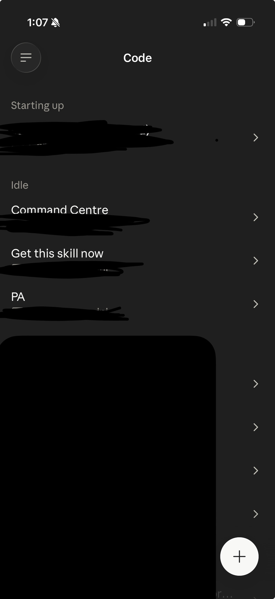
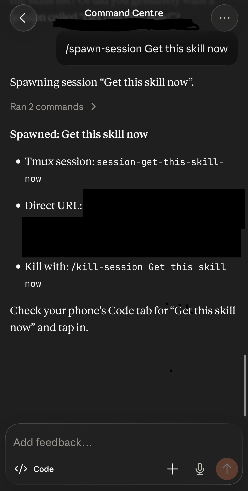
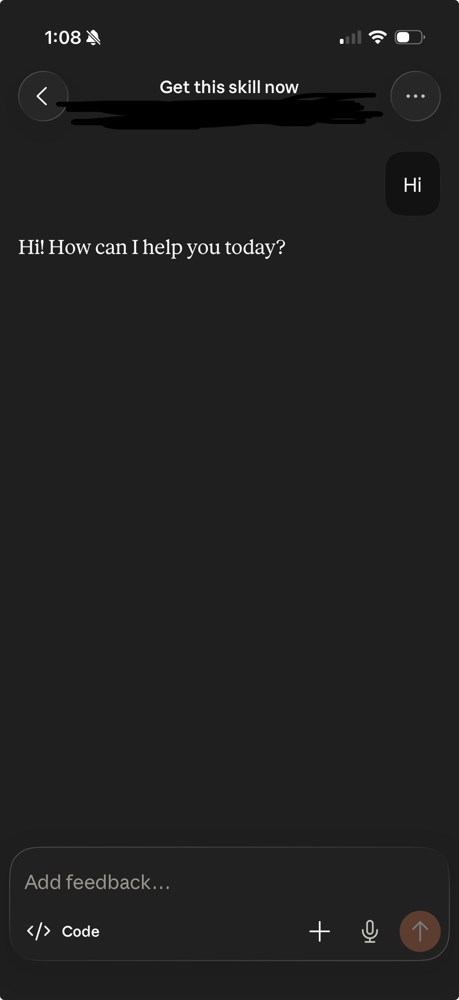

# Claude Remote Control — Always-On

Run [Claude Code](https://docs.claude.com/en/docs/claude-code)'s `claude remote-control` as an always-on macOS LaunchAgent, so a named Claude Code session is permanently available in the Claude iOS app's Code tab. Tap in from your phone, anywhere, anytime. No terminal to keep open. No tunnel to configure.

  

<p align="center">
    
    &nbsp;&nbsp;
    
    &nbsp;&nbsp;
    
</p>

<p align="center">
    <em>Left: the Code tab lists your always-on Command Centre plus any sessions you spawned. Middle: typing <code>/spawn-session</code> inside Command Centre creates a new ephemeral session on the Mac, tmux session and env URL returned. Right: tap the new session, say hi, get a reply — full round-trip from phone through LaunchAgent + tmux + claude + Anthropic and back.</em>
</p>


## What this solves

`claude remote-control --name "X"` exposes a local Claude Code session to the Claude iOS app's Code tab (the "Remote control" sessions on your phone). It works great in an interactive terminal, but the moment you close the terminal the session dies. The phone loses access. You have to walk back to the Mac and type the command again.

This repo makes that persistent :

- **Always on** — LaunchAgent starts the session at login, keeps it running, auto-restarts on crash
- **No TTY** — wrapped in tmux so it runs headless cleanly
- **Phone access** — tap `Command Centre` in the Claude iOS Code tab, you're in
- **Spawn more sessions from your phone** — included `/spawn-session`, `/kill-session`, `/list-sessions` slash commands for ephemeral task-specific sub-sessions
- **Parameterised** — installer prompts for your bundle ID / paths / working directory

## Why this is non-trivial

Building this hits **six silently-failing blockers**, all undocumented in Claude Code's docs (as of 2.1.114). The installer handles all of them :

1. `claude remote-control` rejects long-lived OAuth tokens ; requires a `claude.ai` session
2. launchd default file descriptor limit (256) is too low for claude
3. `USER` + `LOGNAME` must be set in the plist for claude.ai session lookup
4. `WorkingDirectory` in the plist hits macOS TCC on `~/Documents/`
5. `claude remote-control` refuses to run in an untrusted workspace
6. launchd provides no TTY — claude fails with a useless generic error

See [`docs/blockers.md`](docs/blockers.md) for the full deep-dive on each.

## Quick start

**Prerequisites** :

- macOS (tested on 14+, should work on 12+)
- [Claude Code](https://docs.claude.com/en/docs/claude-code) installed (`claude --version` prints 2.1.x)
- [tmux](https://github.com/tmux/tmux) installed : `brew install tmux`
- You've run `claude auth login` (web-auth, not `claude setup-token`) at least once

**Install** :

```bash
git clone https://github.com/YOUR_USER/claude-remote-control-always-on.git
cd claude-remote-control-always-on
./install.sh
```

The installer prompts for :

- **Bundle ID** (default : `com.<username>.command-centre`) — launchd label
- **Claude binary path** (default : `$(which claude)`)
- **Working directory** (default : `~/Documents/Claude Code`) — must be a trusted claude workspace
- **Session display name** (default : `Command Centre`)

On completion :

- LaunchAgent is loaded and running
- tmux session `command-centre` alive
- `claude remote-control` connected to Anthropic
- Skill + slash commands installed to `~/.claude/`

**Test from your phone** :

1. Open the Claude iOS app → Code tab
2. You should see your session (e.g., `Command Centre`)
3. Tap in, send a message, get a reply

## Slash commands (spawn more sessions from your phone)

Once the persistent Command Centre is running, you can spawn additional ephemeral sessions directly from the phone :

| Command | Action |
|---|---|
| `/spawn-session <name>` | Starts a new `claude remote-control --name "<name>"` in a detached tmux. Appears in Code tab within ~5s. |
| `/kill-session <name>` | Stops that session. Drops off Code tab after backend reap. |
| `/list-sessions` | Shows every active session with env URL, type, and runtime. |

Ephemeral by default (dies on reboot). The persistent Command Centre is protected — `/kill-session Command Centre` refuses.

Type slash commands inside Command Centre on the phone. iOS doesn't show slash-command autocomplete, so either memorise or use natural language ("spawn me a session called Email Triage") — Claude interprets intent either way.

## Management

```bash
# Check status
launchctl list | grep command-centre
tmux ls

# Tail logs
tail -30 ~/Library/Logs/command-centre/command-centre.tmux.log

# Restart cleanly
launchctl kickstart -k gui/$(id -u)/<your-bundle-id>

# Stop (until next login)
launchctl bootout gui/$(id -u)/<your-bundle-id>

# Uninstall completely
./install.sh --uninstall
```

## Troubleshooting

See [`docs/blockers.md`](docs/blockers.md) for each blocker with its symptom, cause, and fix.

Most common on first install :

- **"You must be logged in to use Remote Control"** → run `claude auth login` first (web-auth, not `claude setup-token`)
- **LaunchAgent shows PID `-` with exit code 1** → check `~/Library/Logs/command-centre/command-centre.tmux.log` for the real error
- **Multiple "Command Centre" entries in phone Code tab after debugging** → expected. Each restart registers a new `env_*` ID ; Anthropic's backend reaps dead ones within hours.

## Architecture

```
iPhone (Claude app, Code tab)
        │
        │  (Anthropic's sync)
        ▼
launchd   →  wrapper.sh  →  tmux new-session -d  →  claude remote-control
(at login    (cd to work     (pseudo-TTY host)       --name "Command Centre"
 + watch)     dir, spawn,
              monitor)
```

Three components :

1. **LaunchAgent plist** at `~/Library/LaunchAgents/<bundle-id>.plist` — launchd manages it, starts at login, restarts on crash (`KeepAlive=true`).
2. **Wrapper script** at `~/scripts/command-centre/run.sh` — `cd`s to a trusted workspace, spawns detached tmux, monitors the tmux session. Exits non-zero if tmux dies so launchd respawns.
3. **tmux session** `command-centre` — provides the pseudo-TTY that `claude remote-control` needs. Hosts the actual claude process.

Spawned sessions (`/spawn-session`) use the same tmux pattern but without launchd — they're ephemeral by design.

## Contributing

Issues and PRs welcome. If you find a seventh blocker, or hit this on a macOS version I haven't tested, please [open an issue](../../issues).

## License

MIT — see [LICENSE](LICENSE).

## Credits

Built while trying to get Claude Code phone-accessible from a Mac mini running as a home server. Six hours of debugging, documented so no one else has to repeat it.
